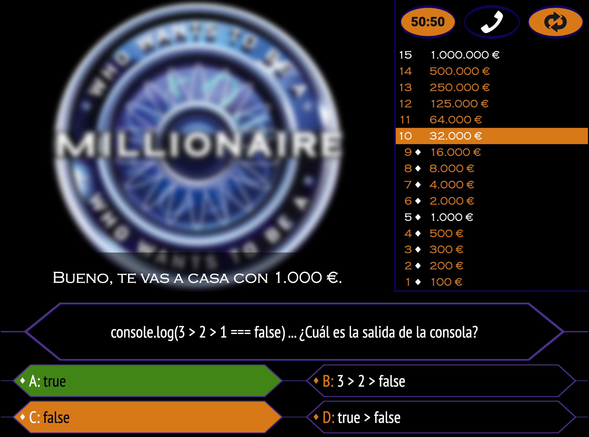

<p align="center"></p>

<h1 align="center">Who Wants to be a Millionaire - JavaScript Edition</h1>

<details>
  <summary>Table of Contents</summary>
  <ol>
    <li><a href="#overview">Overview</a></li>
    <li><a href="#features">Features</a></li>
    <li><a href="#technologies-used">Technologies Used</a></li>
    <li><a href="#project-preview">Project Preview</a></li>
    <li><a href="#accessing-the-website">Accessing the Website</a></li>
    <li><a href="#playing-the-game">Playing the Game</a></li>
     <li><a href="#installation">Installation</a></li>
    <li><a href="#future-improvements">Future Improvements</a></li>
  </ol>
</details>

## Overview

This project is a <b>Who Wants to be a Millionaire</b> style game built with vanilla JavaScript. The game interacts dynamically with the web interface using the virtual DOM and retrieves trivia questions via the fetch API. It provides an engaging quiz experience with increasing difficulty as the player progresses, and includes three lifelines similar to the TV show.

## Features

<ul>
  <li><b>Dynamic Question Display</b>: Questions are displayed randomly without repetition throughout the game session.</li>
  <li><b>Multiple Categories</b>: Categories are randomized and the same category will not appear more than twice in a row.</li>
  <li><b>Randomized Answer Options</b>: Answers are displayed in random order, ensuring the correct answer doesn’t appear in the same position every time.</li>
  <li><b>Progressive Difficulty</b>: Question difficulty increases as the player advances.</li>
  <li><b>Interactive Answer Selection</b>: Answer choices are highlighted when selected. The first click highlights the answer, and the second confirms it, revealing whether the choice was correct or not.</li>
  <li><b>Lifelines</b>:</li>
  <ol>
    <li><b>50/50</b>: Removes two incorrect answers.</li>
    <li><b>Phone a Friend</b>: Suggests an answer with 70% accuracy, increasing to 90% if the 50/50 lifeline has already been used.</li>
    <li><b>Flip the Question</b>: Replaces the current question with another one of the same difficulty level.</li>
  </ol>
  <li><b>In-Game Sound Effects</b>: Audio cues play when a lifeline is used or when an answer is revealed, enhancing the game experience.</li>
</ul>

## Technologies Used

This project is designed to showcase the power of Virtual DOM manipulation and Vanilla JavaScript and, as such, is deliberately minimalistic in terms of technologies, operating through only 3 files: `index.html`, `style.css` and `main.js` (excluding media).

<ul>
  <li><b>JavaScript (ES6+)</b>: Core language used to build the game logic and handle dynamic interactions.</li>
  <li><b>Virtual DOM Manipulation</b>: For dynamic updates to the game interface.</li>
  <li><b>CSS3</b>b: Styling for the interface, including keyframes animations.</li>
  <li><b>HTML5</b>: Essentially a boilerplate with one root container to which DOM commands are applied.</li>
</ul>

## Project Preview

### In game 
### Phone a Friend 
### 50-50 
### Losing screen 

## Accessing the Website

You can play the game <a href="https://qqsm-domtree.vercel.app/">here</a>.
Please be patient when starting the game—since the API used for trivia questions is not owned by the developer, it may take up to a minute for the questions to load.

## Playing the Game

<ul>
  <li>Start the game by pressing "¿Comenzar Juego?"</li>
  <li>Please wait while the questions are retrieved from an external API (this may take up to a minute)</li>
  <li>Click on the answer you think is right. Click it again to confirm or click another.</li>
  <li>Click a lifeline at the top right to activate it. Use them wisely as each one can only be used once per game!</li>
  <li>Any wrong answer ends the game and you will only be awarded the amount from the previous checkpoint (if applicable).</li>
  <li>Hovering over the logo will offer the user the opportunity to walk away with the money they have already in the bank (providing it is not a checkpoint level).</li>
</ul>

## Installation
To install Who Wants To Be A Millionaire locally, follow these steps:

<ol>
<li>Clone the repository:
  
```bash
git clone https://github.com/nuinn/whowantstobeamillionaire.git
```
<li>Open the `index.html` file in your preferred browser.
</ol>

## Future Improvements
<ol>
  <li><b>Mobile & Tablet Responsiveness</b>: Improving the design for better usability on smaller screens (responsive web design).</li>
  <li><b>Backend with REST API</b>: Plan to implement a backend that allows:</li>
  <ol>
    <li>User registration and login</li>
    <li>Creation, modification and deletion of user-created quizzes.</li>
    <li>Tracking of quiz plays and statistics</li>
  </ol>
  <li><b>Possible Application:</b>Teacher/Student Integration:</li>
  <ol>
    <li><b>Teacher Role</b>: Allow teachers to create quizzes and track students’ progress through a login-based system.</li>
    <li><b>Student Role</b>: Enable students to practice quizzes assigned by their teachers.</li>
    <li><b>Progress Tracking</b>: Teachers will be able to monitor student progress over time.</li>
  </ol>
</ol>

<br>

Feel free to contribute to Who Wants To Be A Millionaire by submitting pull requests or reporting issues on GitHub. Your feedback is valuable in improving the application and addressing community needs effectively.

<br>

<h3 align="center">Licensed and Developed by</h3>

<p align="center">Marc Dilley</p>
<p align="center">
<a href = "mailto:marcdilley@gmail.com"></a>
    <a href="https://www.linkedin.com/in/marc-dilley-288407a1/" target="_blank"></a> 
  <a href="https://github.com/nuinn/"></a>
</p>
